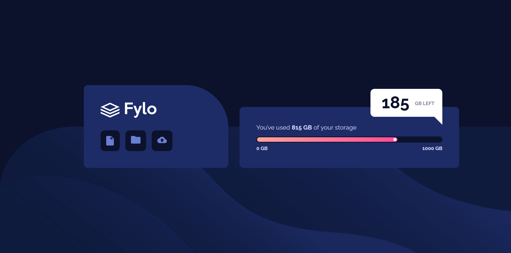

# Frontend Mentor - Fylo data storage component solution

This is a solution to the [Fylo data storage component challenge on Frontend Mentor](https://www.frontendmentor.io/challenges/fylo-data-storage-component-1dZPRbV5n). Frontend Mentor challenges help you improve your coding skills by building realistic projects. 

### The challenge

Users should be able to:

- View the optimal layout for the site depending on their device's screen size

- [Solution](https://www.frontendmentor.io/solutions/fylo-data-storage-component---html-css-1A6Rl8Z1fc)
- [Live Site](https://lspacka.github.io/FEM-fylo-data-storage-component/)

### Built with
- HTML
- CSS

## Author

- [Frontend Mentor](https://www.frontendmentor.io/profile/lspacka)
- [Twatter](https://www.twitter.com/lspacka)
